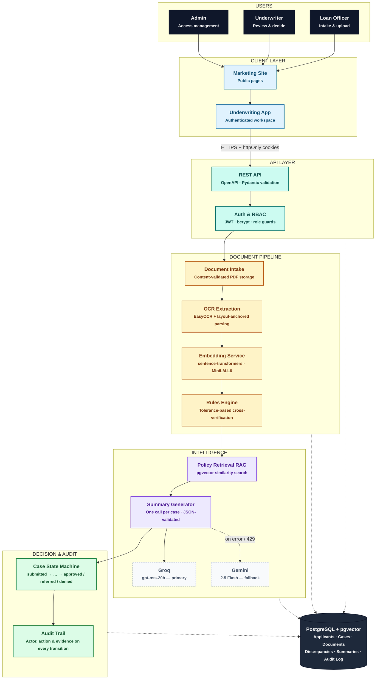

# Verity Mortgage

**An underwriting document automation platform for residential mortgage lending.**

Verity ingests a loan applicant's document packet, cross-verifies every
figure against the stated application, flags discrepancies with
tolerance-based rules, and produces an underwriter-ready summary with a
routing recommendation — all backed by a complete, queryable audit trail.

[](https://github.com/abdullahfullstackdev7/verity-mortgage/actions/workflows/ci.yml)


---

## Overview

Mortgage underwriting is, today, still largely a manual reading exercise: a
loan officer or underwriter opens a pay stub, a bank statement, and a W-2,
and mentally cross-checks every figure against what the applicant declared
on the application. It does not scale, it is inconsistent across
reviewers, and discrepancies — understated income, mismatched employer
names, deposit patterns that don't add up — are caught late or missed
entirely.

Verity Mortgage is a working reference implementation of the
intake-to-decision workflow used by real mortgage technology platforms. It
automates document intake, OCR-based extraction, rules-based
cross-verification, and AI-assisted narrative summarization, and routes
every case to an auditable outcome: automatic approval, referral for human
review, or a mandatory manual decision — never a silent, unexplained one.

The platform is built on the public HMDA (Home Mortgage Disclosure Act)
Loan Application Register for ground-truth realism, paired with
synthetically generated — not real — supporting documents, since real
applicant financial documents are private and cannot legally be used in a
demo or training pipeline. See [Dataset and Provenance](#dataset-and-provenance)
for the full explanation.

## Objectives

- **Automate document-to-application cross-verification** so income,
  employer identity, and deposit figures are checked against every
  supporting document without a human reading each page by hand.
- **Make every discrepancy explainable**, not just flagged — each one
  carries the stated value, the document value, the variance percentage,
  and the source document that produced it.
- **Keep every decision auditable.** Every case-status transition, whether
  made by the system or a human, writes an audit-log entry naming the
  actor and the specific rule or evidence behind it.
- **Minimize AI cost and surface area.** Exactly one LLM call per case for
  the narrative summary — never one call per field or per document — with
  automatic failover between two free-tier providers, so the system stays
  operable if either has an outage or rate-limits the request.
- **Enforce access control at the API, not the UI.** Every state-changing
  route is gated by role-based authorization as a server-side dependency;
  hiding a button client-side is never the security boundary.
- **Ship as a fully working reference system**, not a slide deck: real
  database schema, real OCR pipeline, real tests, real CI.

## What We Build

| Capability | Description |
|---|---|
| **Document intake** | Loan officers upload pay stubs, bank statements, and W-2s (PDF, validated by content signature, not filename) against an open case. |
| **OCR extraction** | Each document is run through EasyOCR, then parsed with deterministic, layout-anchored rules per document type to populate structured fields with a confidence score. |
| **Semantic field matching** | Extracted text (e.g. employer name) is embedded locally with a sentence-transformers model and compared by cosine similarity, so "ACME Corp" and "ACME Corporation" are recognized as a match rather than flagged as a mismatch. |
| **Cross-verification rules engine** | Deterministic, tolerance-based checks compare every extracted figure against the applicant's stated application data — income, employer identity, bank deposit totals, and a recomputed debt-to-income ratio — and record any out-of-tolerance result with a severity level. |
| **AI-assisted case summary** | One LLM call per case turns the applicant's figures and flagged discrepancies into a narrative summary and a recommendation (approve / refer / deny), grounded with retrieved excerpts from an internal underwriting policy corpus (RAG over pgvector). |
| **Decision routing & audit trail** | A guarded case-status state machine auto-approves clean cases, auto-refers minor-only flags, and blocks auto-approval on any major discrepancy pending a mandatory human decision — every transition logged. |
| **Underwriting application** | An authenticated, role-aware React application: a case queue, a two-pane case-review screen (documents beside extracted/flagged fields), a decision panel, and a full audit-trail view. |
| **Public marketing site** | A production-quality public site (Home, Solutions, How It Works, Security, About, Contact) gating access to the authenticated application behind login. |

## How It Helps

- **Cuts manual review time.** Every figure a reviewer would otherwise
  cross-check by hand is pre-verified before the case reaches a human, and
  clean cases never need to reach one at all.
- **Catches what manual review misses.** Deterministic tolerance rules and
  semantic name matching apply the same standard to every case, every
  time — no reviewer fatigue, no inconsistency across shifts.
- **Turns "why was this flagged" into a one-glance answer.** The
  discrepancy panel shows the stated value, the document value, and the
  variance side by side, with the exact source document, instead of
  requiring a reviewer to re-derive it.
- **Makes every decision defensible after the fact.** The audit trail
  captures not just *what* changed, but *why* — the rule threshold
  breached or the discrepancy that forced a manual decision — for every
  case, every time.
- **Stays cheap to operate.** The rules engine and OCR pipeline run
  entirely without paid AI calls; the one LLM call per case is
  token-minimized (only the discrepancy summary and applicant figures are
  sent, never full document text) and fails over automatically between
  two free-tier providers.

## Architecture

Verity is a monorepo: a FastAPI backend, a React/TypeScript frontend, and a
PostgreSQL database with the `pgvector` extension for embedding-based
similarity search. The diagram below traces one case end to end — from
document upload through OCR extraction, rules-based verification,
AI-assisted summarization, and routing to a final, audited decision.



**How to read it:** solid arrows are the request/data flow of a single
case moving through the system; dashed arrows into the database represent
each layer persisting its output as it completes, so a case's full
history — not just its current state — is always reconstructable. The
intelligence layer's dashed edge to Gemini is the failover path, only
taken when Groq errors or rate-limits.

### Case lifecycle

```
submitted → documents_pending → under_review → { approved | referred | denied }
```

- **No discrepancies** → auto-approved, recommendation logged.
- **Minor discrepancies only** → auto-referred for human review, summary
  pre-filled.
- **Any major discrepancy** → stays `under_review`, auto-approval blocked,
  a manual underwriter decision is mandatory. An underwriter may accept
  the system's recommendation or override it — an override always
  requires a stated reason, which is written to the audit log alongside
  the decision.

## Tech Stack

| Layer | Technology |
|---|---|
| Backend language | Python 3.12 |
| Backend framework | FastAPI, Pydantic v2 |
| Database | PostgreSQL 16 with the `pgvector` extension |
| ORM / migrations | SQLAlchemy 2.0 + Alembic |
| Auth | JWT (access + refresh, rotated on use), bcrypt password hashing, role-based access control enforced server-side |
| Document generation (demo data) | Jinja2 + xhtml2pdf, Faker |
| OCR / extraction | EasyOCR, deterministic layout-anchored parsing |
| Embeddings | `sentence-transformers/all-MiniLM-L6-v2`, run locally — no paid API |
| LLM providers | Groq (`openai/gpt-oss-20b`) primary, Google Gemini (`gemini-2.5-flash`) automatic fallback, both free-tier |
| Frontend | React 19 + TypeScript, Vite, Tailwind CSS v4, shadcn/ui on Base UI |
| Frontend testing | Vitest + React Testing Library, Playwright (E2E) |
| Backend testing | Pytest |
| Lint / type-check | ruff, mypy (backend); oxlint, tsc (frontend) |
| CI | GitHub Actions — lint, type-check, and the full test suite on every PR |
| Containerization | Docker Compose (`pgvector/pgvector:pg16`) |

## Project Structure

```
verity-mortgage/
├── backend/
│   ├── alembic/                 # Database migrations
│   └── app/
│       ├── api/v1/routes/       # FastAPI route modules
│       ├── core/                # Config, security, cookies, rate limiting
│       ├── db/models/           # SQLAlchemy ORM models
│       ├── schemas/             # Pydantic request/response schemas
│       └── services/
│           ├── extraction/      # OCR + field parsing + embeddings
│           ├── rules/           # Cross-verification rules engine
│           ├── policy/          # RAG ingestion & retrieval
│           ├── summary/         # LLM-assisted case summary
│           └── llm/             # Groq / Gemini provider abstraction
├── frontend/
│   ├── src/pages/                # Marketing site + authenticated app pages
│   ├── src/components/app/       # Case queue, case detail, decision panel
│   └── e2e/                      # Playwright end-to-end suite
├── generators/                   # Synthetic document generation (paystub, W-2, bank statement)
├── scripts/                      # Dataset cleaning, seeding, validation utilities
├── data/                         # Processed HMDA sample, generated documents, policy corpus
└── .github/workflows/ci.yml      # Lint, type-check, backend + frontend + E2E tests
```

## Getting Started

### Prerequisites

- Python 3.12+ and [`uv`](https://docs.astral.sh/uv/)
- Node.js 22+
- Docker (for the Postgres + pgvector container)

### 1. Start the database

```bash
docker compose up -d
```

### 2. Configure environment variables

```bash
cp .env.example .env
```

Every variable is documented in `.env.example` with a non-functional
placeholder; local defaults (`ENV=local`, `DATABASE_URL` pointing at the
compose Postgres instance) work out of the box. `GROQ_API_KEY` /
`GEMINI_API_KEY` are optional — without either, the summary step is
skipped rather than erroring.

### 3. Install dependencies and run migrations

```bash
uv sync
uv run alembic upgrade head
```

### 4. Seed and generate demo data

```bash
uv run python -m backend.app.db.seed
uv run python -m generators.build_all --count 200
```

### 5. Run the backend

```bash
uv run uvicorn backend.app.main:app --reload
```

The interactive API reference is served at `http://localhost:8000/docs`
(OpenAPI, auto-generated from the route and schema definitions).

### 6. Run the frontend

```bash
cd frontend
npm install
npm run dev
```

## Dataset and Provenance

Applicant financial figures — income, loan amount, property value,
debt-to-income ratio — come from the public HMDA Modified Loan Application
Register, published by the CFPB/FFIEC as public-domain government data.

Pay stubs, bank statements, and W-2s are **synthetically generated** from
those figures using Faker and template rendering. They are not, and do not
represent, any real person's documents — real applicant financial
documents are private and cannot legally be used in a demo or training
pipeline, so this is a deliberate design choice, not an oversight.

For roughly 15–20% of generated applicants, one document-side figure is
deterministically altered (e.g. the pay stub's annualized income set
15–30% above or below the stated figure), so the resulting mismatch is
reproducible and scoreable against a stored ground truth. This is what
lets the rules engine and OCR pipeline be validated end to end —
`scripts/validate_demo_dataset.py` runs a synthetic applicant pool through
real OCR and the rules engine and reports the resulting clean / minor /
major classification split against that target. A 150-applicant run
produced:

| Outcome | Count | Share |
|---|---|---|
| Clean | 116 | 77.3% |
| Minor discrepancy | 5 | 3.3% |
| Major discrepancy | 29 | 19.3% |

The injector's own ground truth for that run was 14.7% injected (22/150);
the pipeline's classified discrepancy rate (22.7%) lands close to it but
skews toward major rather than minor severity, since the injector's
15–30% variance range spans both the rules engine's minor band (10–20%)
and its major cutoff (>20%) — most injected mismatches land past 20% and
are therefore classified major, which is the engine behaving as designed
rather than a discrepancy between the two measurements.

## Testing & CI

| Suite | Command | Covers |
|---|---|---|
| Backend (pytest) | `uv run pytest -q` | Rules engine, extraction pipeline, case state machine, auth/RBAC, encryption, rate limiting, API routes. |
| Backend lint / format | `uv run ruff check .` / `uv run ruff format --check .` | |
| Backend type-check | `uv run mypy .` | |
| Frontend (Vitest + RTL) | `cd frontend && npm run test` | Auth-gated routing, login form, case-review and decision components. |
| Frontend lint / type-check | `npx oxlint` / `npx tsc -b` | |
| E2E (Playwright) | `cd frontend && npm run test:e2e` | Login, opening a case from the queue, and an underwriter recording a decision — against real backend + frontend dev servers and a seeded fixture case. |

All of the above run on every pull request via `.github/workflows/ci.yml`.

## Security

Concrete status of each control, not aspirational. "Local dev" means the
default `.env` / `ENV=local` configuration this repo ships with.

| Control | Status | Where |
|---|---|---|
| HTTPS enforced outside local dev | ✅ | `HTTPSRedirectMiddleware` + HSTS header, mounted only when `ENV != local` (`backend/app/main.py`). |
| httpOnly, Secure, SameSite=Strict auth cookies | ✅ | `backend/app/core/cookies.py`. The frontend never reads a token into JS-accessible storage. |
| Password policy: length + complexity | ✅ | Minimum 10 characters, at least one letter and one digit (`backend/app/schemas/user.py`). |
| Password hashing | ✅ | bcrypt, default work factor (`backend/app/core/security.py`). |
| JWT access tokens short-lived | ✅ | 20 minutes by default. |
| Refresh tokens rotated + revocable | ✅ | Single-use rotation on every refresh; a revocation list is checked on every call (`backend/app/services/auth_service.py`). |
| Role-based authorization at the API layer | ✅ | Every state-changing route is gated by `require_roles(...)` as a server-side dependency, not a UI-only check. |
| Input validation on every endpoint | ✅ | Pydantic schemas on every request body; path/query params are typed. |
| Strict file-type/size validation on uploads | ✅ | PDFs validated by content signature, not filename or client-sent content-type; size capped. |
| Rate limiting on login | ✅ | 5 failed attempts per (IP, email) per 5-minute window. **Limitation**: in-process, resets on restart, not shared across workers without a Redis-backed store. |
| Field-level encryption at rest | ✅ (scoped) | Applicant's stated financial figures encrypted via PostgreSQL `pgcrypto`, transparent to the ORM. **Scope note**: `extracted_fields.extracted_value` is not encrypted — a documented gap, not a silent one. |
| CORS locked to known origins | ✅ | Explicit allowlist via `CORS_ORIGINS`, never a wildcard. |
| Secrets from environment, never committed | ✅ | All keys loaded via `pydantic-settings`; `.env` gitignored; `.env.example` documents every variable. |
| Full audit logging of state changes | ✅ | Every case-status transition writes an `audit_log` row naming the actor and the specific rule/evidence behind it. |
| Automated tests: unauthorized/cross-role rejection | ✅ | Every protected route has an "unauthenticated → 401" and, where roles differ, a "wrong role → 403" test. |

### Known limitations (stated plainly, not fixed here)

- **Rate limiter is per-process, in-memory** — fine for a single instance,
  needs a shared store (Redis) before running with multiple workers.
- **No separate CSRF token scheme** — `SameSite=Strict` cookies cover the
  classic CSRF vector for this app's same-site deployment shape; revisit
  if frontend and backend ever move to different top-level domains.
- **`extracted_fields.extracted_value` is not encrypted at rest** — it
  holds figures pulled from source PDFs that are themselves stored
  unencrypted on disk today, a real gap for a genuine production
  deployment.
- **HSTS `preload` is not set** — a deployment-time decision for a real
  domain, not something baked into the app.

## API Documentation

The full API reference is auto-generated from the FastAPI route and
Pydantic schema definitions and served interactively at `/docs`
(Swagger UI) and `/redoc` when the backend is running.

## License

No open-source license is currently declared for this repository; all
rights reserved by default pending a licensing decision. The underlying
applicant figures are public-domain HMDA data (CFPB/FFIEC); the generated
documents and application code are not licensed for reuse without
permission.
